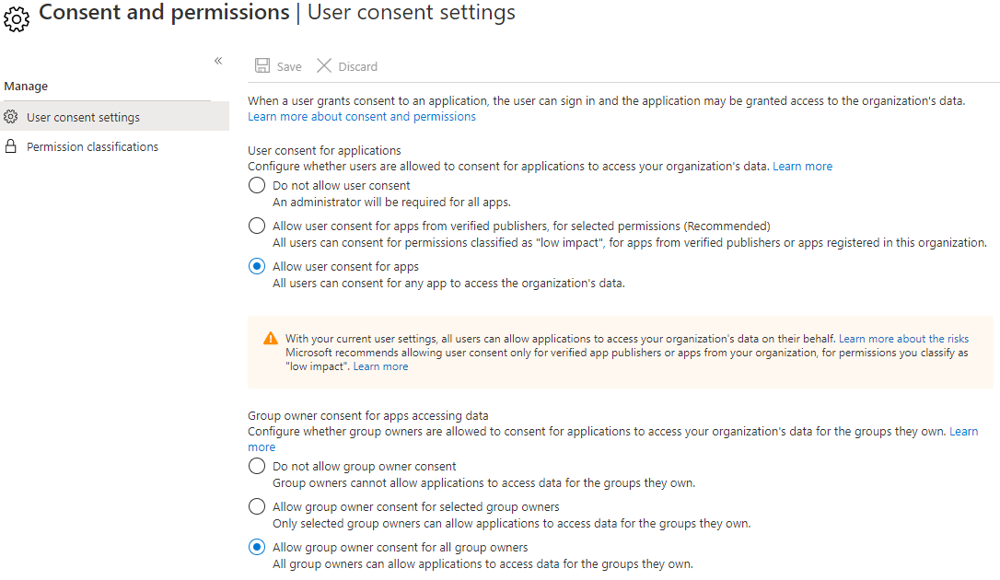

## onfigure how end-users consent to applications

You can integrate your applications with the Microsoft identity platform to allow users to sign in with their work or school account and access your organization's data to deliver rich data-driven experiences.

Before an application can access your organization's data, a user must grant the application permissions to do so. Different permissions allow different levels of access. By default, all users are allowed to consent to applications for permissions that don't require administrator consent. For example, by default, a user can consent to allow an app to access their mailbox but can't consent to allow an app unfettered access to read and write to all files in your organization.

By allowing users to grant apps access to data, users can easily acquire useful applications and be productive. However, in some situations this configuration can represent a risk if it's not monitored and controlled carefully.

### User consent settings
App consent policies describe conditions which must be met before an app can be consented to. These policies may include conditions on the app requesting access, as well as the permissions the app is requesting. By choosing which app consent policies apply for all users, you can set limits on when end-users are allowed to grant consent to apps, and when they will be required to request administrator review and approval:

+ *Disable user consent* - Users cannot grant permissions to applications. Users can continue to sign in to apps they had previously consented to or which are consented to by administrators on their behalf, but they will not be allowed to consent to new permissions or to new apps on their own. Only users who have been granted a directory role that includes the permission to grant consent will be able to consent to new apps.

+ *Users can consent to apps from verified publishers or your organization, but only for permissions you select* - All users can only consent to apps that were published by a verified publisher and apps that are registered in your tenant. Users can only consent to the permissions you have classified as "low impact". You must classify permissions to select which permissions users are allowed to consent to.

+ *Users can consent to all apps* - This option allows all users to consent to any permission which doesn't require admin consent, for any application.

Custom app consent policy - For even more options over the conditions governing when user consent, you can create custom app consent policy, and configure those to apply for user consent.

