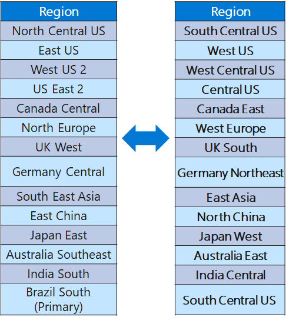

## Region Pairs

 It's possible that a large enough disaster could cause an outage large enough to affect even two datacenters. That's why Azure creates region pairs. Each Azure region is paired with another region within the same geography (such as US, Europe, or Asia) at least 300 miles away, which together make a [region pair](https://docs.microsoft.com/azure/best-practices-availability-paired-regions?azure-portal=true
). The exception is Brazil South, which is paired with a region outside its geography.

## Things to know about regional pairs:

+ **Physical isolation**. When possible, Azure prefers at least 300 miles of separation between datacenters in a regional pair, although this isn't practical or possible in all geographies. Physical datacenter separation reduces the likelihood of natural disasters, civil unrest, power outages, or physical network outages affecting both regions at once. 

+ **Platform-provided replication**. Some services such as Geo-Redundant Storage provide automatic replication to the paired region.

+ **Region recovery order**. In the event of a broad outage, recovery of one region is prioritized out of every pair. Applications that are deployed across paired regions are guaranteed to have one of the regions recovered with priority. 

+ **Sequential updates**. Planned Azure system updates are rolled out to paired regions sequentially (not at the same time) to minimize downtime, the effect of bugs, and logical failures in the rare event of a bad update.

Since the pair of regions is directly connected and far enough apart to be isolated from regional disasters, you can use them to provide reliable services and data redundancy. Some services offer automatic geo-redundant storage using region pairs.

Additional advantages of region pairs include:

- If there's an extensive Azure outage, one region out of every pair is prioritized to make sure at least one is restored as quick as possible for applications hosted in that region pair.
- Planned Azure updates are rolled out to paired regions one region at a time to minimize downtime and risk of application outage.
- Data continues to reside within the same geography as its pair (except for Brazil South) for tax and law enforcement jurisdiction purposes.

Having a broadly distributed set of datacenters allows Azure to provide a high guarantee of availability. 

✔️ View the complete list of [region pairs](https://docs.microsoft.com/azure/best-practices-availability-paired-regions#what-are-paired-regions?azure-portal=true).
